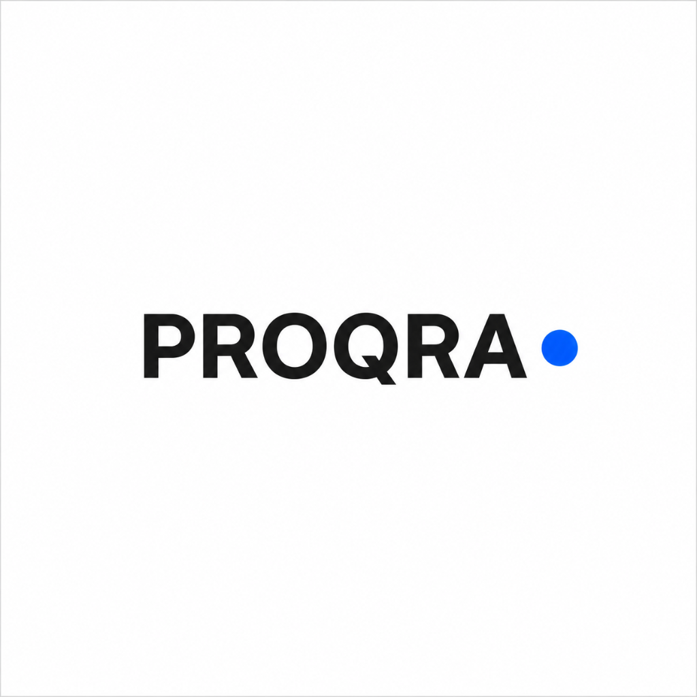

  

# Proqra

Flawless procurement data managed for you.

---

## What We Do

Clean procurement data shouldn't require a bloated headcount, endless spreadsheet wrangling, or overpriced consulting engagements.

Proqra combines deep supply chain expertise with software automation to take care of everyday procurement operations and maintain accurate systems in real time.

### Core Capabilities

- **Daily Order Execution**: We handle manual PR-to-PO workflows and routine supplier follow-ups so your team can focus on purchasing strategy and vendor negotiations.
- **ERP Data Management**: We clean master data, resolve outdated material records, and maintain vendor databases across ERP environments.
- **Live MI Reporting**: Custom, real-time dashboards replacing static spreadsheets to deliver clear visibility into spend, delivery lead times, and fulfillment bottlenecks.

---

## Website

Learn more at [proqra.co.uk](https://proqra.co.uk).

---

## Contact & Suggestions

Whether you have inquiries, operational questions, suggestions, or would like to explore working together, please get in touch directly:

**Email**: [pranav.shijusheeja@proqra.co.uk](mailto:pranav.shijusheeja@proqra.co.uk)
